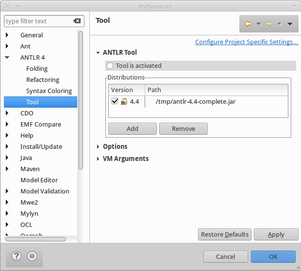

# Instalación y configuración de ANTLR v4

Existen varias alternativas para [utilizar ANTLR4](http://www.antlr.org/tools.html). En este tutorial nos enfocaremos en utilizar [Eclipse](http://www.eclipse.org/) y [Maven](https://maven.apache.org/). A pesar de ello, este tutorial debería servir con cambios mínimos para cualquiera de las demás herramientas disponibles.

Se asume que el lector tiene las siguientes competencias:
* JDK
    - Instalar JDK

* Eclipse
    - Instalar Eclipse
    - Instalar plugins
    - Importar proyectos
    - Desarrollar en Java con Eclipse

* Maven
    - Crear un proyecto Maven
    - Manejo de archivos `pom.xml`
        - Configurar repositorios
        - Configurar dependencias
        - Configurar proceso de construcción (build)

## I. Instalación de entorno de desarrollo
Todo el software requiere instalar **JDK 11, ya sea la versión de Oracle u OpenJDK**, el cual debe ser habilitado como el JDK por defecto del sistema operativo. Habrán problemas si se utiliza una versión posterior.

El repositorio de este tutorial contiene muchos archivos útiles para la instalación. La forma más simple de descargar el repositorio es:

1. Descargar el archivo `antlr4-tutorial-master.zip` desde este [enlace](https://github.com/jpavlich/antlr4-tutorial/archive/master.zip).
2. Descomprimir el archivo `antlr4-tutorial-master.zip` en la carpeta que desee.


### Eclipse
Hay dos formas de configurar Eclipse como ambiente de desarrollo.

#### Opción automática

Alternativamente, todos los plugins anteriores (m2e) pueden instalarse en forma automática utilizando el archivo de instalación P2F que se encuentra en `antlr4-tutorial-master/install_files/antlr-maven.p2f`.

1. Instalar [Eclipse IDE for Java and DSL Developers (2019-12)](https://www.eclipse.org/downloads/packages/). **Es importante que la versión de Eclipse sea 2019-12. Cualquier otra versión podría no funcionar**
2. Abrir menú `File->Import->Install->Install Software Items from File`
3. Hacer click en `Browse`
4. Buscar y seleccionar el archivo `antlr4-tutorial-master/install_files/antlr-maven.p2f`
5. Seleccionar todos los plugins que aparezcan en la lista 
6. **Deseleccionar** la opción `Install latest version of selected software`. 

#### Opción manual

1. Instalar [Eclipse IDE for Java and DSL Developers (2019-12)](https://www.eclipse.org/downloads/packages/)
2. Instalar el plugin [ANTLR 4 IDE](https://marketplace.eclipse.org/content/antlr-4-ide)

#### Después de instalar Eclipse
Es necesario desactivar una opción del plugin ANTLR 4 IDE. 

1. Abrir las preferencias de Eclipse. 
2. Abrir ANTLR4 -> Tool
3. Desactivar la opción `Tool is activated`. Las opciones deben quedar como en la siguiente imagen:


### Maven

Las instrucciones para instalar maven se encuentran [aquí](https://maven.apache.org/install.html)

## II. Configuración de un proyecto en ANTLR 4

El repositorio también provee un arquetipo de maven, llamado `antlr4-archetype`, para crear proyectos ANTLR4 y una librería, llamada `ast-visualizer` para desplegar árboles semánticos. Los proyectos creados a partir del arquetipo están preconfigurados para comenzar a desarrollar sin mayores inconvenientes (asumiendo que todos los pasos de la instalación hayan sido ejecutados correctamente).

**Los siguientes pasos sólo hay que ejecutarlos una vez:**

* Abrir la línea de comandos e ingresar a la carpeta `antlr4-tutorial-master`.
* Instalar el arquetipo `antlr4-archetype` que se encuentra en `install_files/antlr4-archetype`.
```
cd install_files/antlr4-archetype
mvn clean install
cd ../..
```
* Instalar la librería `ast-visualizer` que se encuentra en `libs/astvisualizer`
```
cd libs/astvisualizer
mvn clean install
```

**El siguiente paso hay que ejecutarlo cada vez que se desee crear un nuevo proyecto:**

* Crear un nuevo proyecto basado en el arquetipo `antlr4-archetype`. En el siguiente comando, reemplace `my-app` por el nombre del proyecto que desea crear y `com.mycompany.app` por el nombre del paquete donde quedarán todos los archivos fuentes de su aplicación.

```
mvn archetype:generate -DgroupId=com.mycompany.app -DartifactId=my-app -DarchetypeArtifactId=antlr4-archetype -DinteractiveMode=false
```

Por ejemplo, para crear una aplicación que se llame `MiLenguaje` y que el código fuente quede en el paquete `com.milenguaje`, debe escribir lo siguiente:

```
mvn archetype:generate -DgroupId=com.milenguaje -DartifactId=MiLenguaje -DarchetypeArtifactId=antlr4-archetype -DinteractiveMode=false
```

Luego de ello, podrá importar el proyecto generado en Eclipse, utilizando la opción `File->Import->Existing Maven Projects`.


